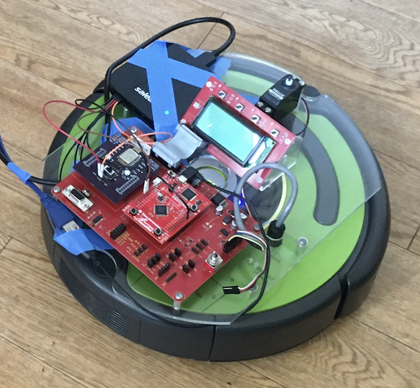
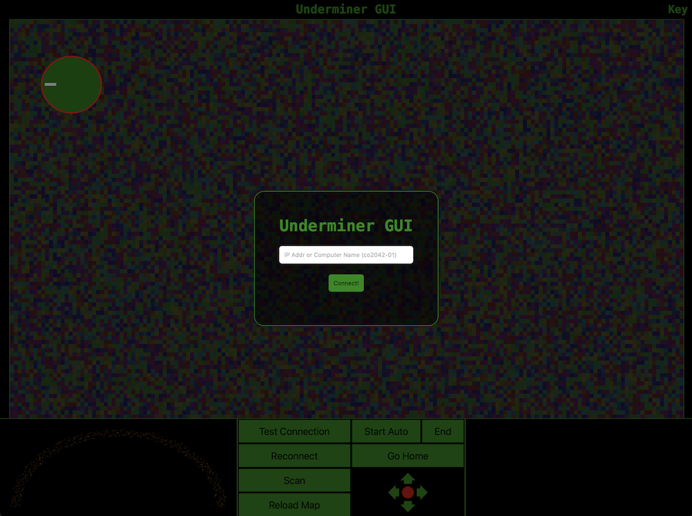

# CPRE 288 Roomba

CPRE 288 was our introductory class to embedded systems. Since I had previously worked in depth on my [Game Controller project (external link)](https://dev.to/glingy/diy-arduino-handheld-game-1hb1) in an embedded system at the register-level, I decided to take this class a step further. I contracted it as an Honors course and agreed to write library code for interfacing with the BNO055 IMU which had not been used significantly in the past. Since this was during the height of COVID-19, our labs were virtual for the semester using a simulated Roomba which did not have the IMU. As a result, I checked out a Roomba from ETG and developed the library for the IMU. This was particularly interesting because previously in my high school FIRST Tech Challenge team, the REV Control Hub we had used had the same IMU. We always used a library to interface with it, but it was interesting to see the same IMU being used again in a different project.

In addition, our final project for the course needed to have the basic functionality of "A user interface". The UART on the TM4C123 was connected to an ESP32 microcontroller to allow us access to the UART stream over WiFi, and I realized that the ESP32 UART stream was being sent as a raw TCP stream we were interacting with using PuTTY.
I had previous experience developing other web-based projects, so I decided to focus my energy on writing a WebSocket-capable (https://www.rfc-editor.org/rfc/rfc6455) server in C by sending and receiving HTTP requests and WebSocket packets over the UART bus. The hardest part was finding a simple SHA-1 implementation that could run on the Roomba, but eventually we used a web-based frontent user interface which worked very well with the Roomba.

[< Back to Projects](/projects)