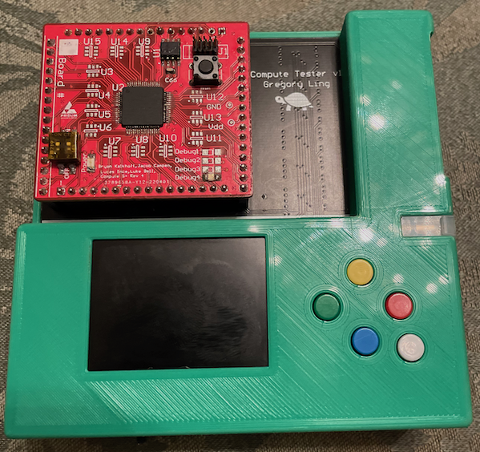

# Compute Tester

The Compute Tester was a project originally started due to a growing number of [computes](/projects/prisum) which were failing to operate correctly. Several of the compute modules had been manually connected to 12V by various members when debugging (12V to a 5V max MCU tends to let out the magic smoke), some had just spontaneously stopped working, and some had just had firmware which turned off the internal oscillator as soon as it starts running. The goal of the Compute Tester is to identify which of the three (or more) categories a given compute falls into and provide instructions for repair or replacement. The hardware for the tester has been designed and assembled, and is now a project I am working with newer members to program. As I get ready to leave the team in a year, this is a good project for them to learn on, so I am trying to not write any of the code myself, but instead guide them in writing the firmware to test the compute modules.

Since it seemed a suitably complex project, I registered the hardware design of the Compute Tester as my Honors Capstone Project and ordered the parts using funding from the Iowa State University Foundation to complete my Honors Program of Study at ISU.

[< Back to Projects](/projects)