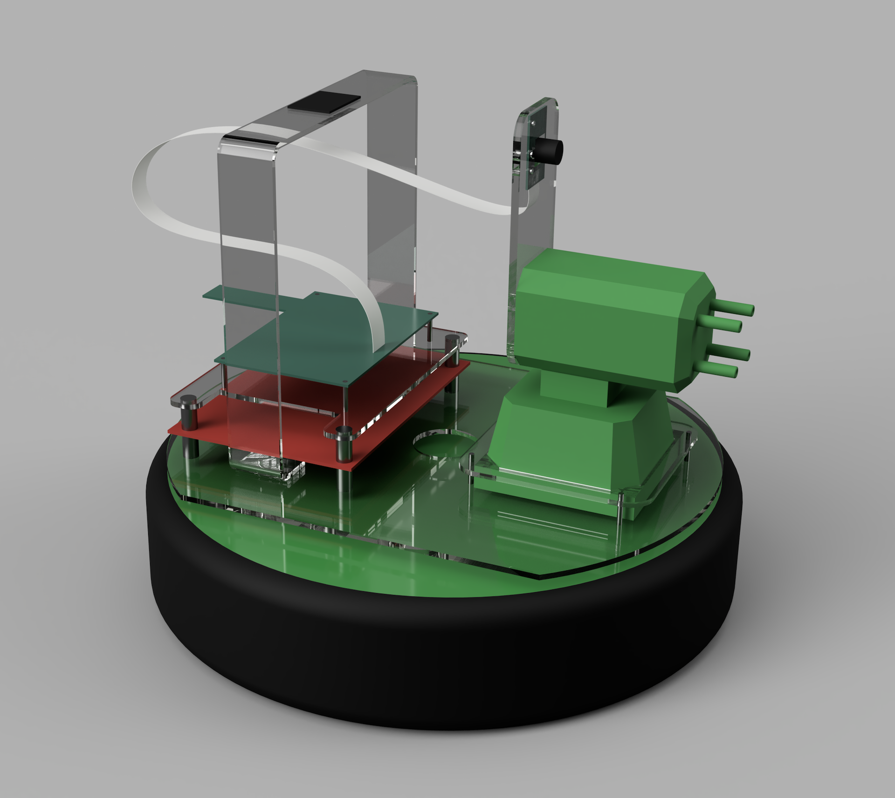

# CPRE 488 Projects

CPRE 488 is focused around the ZedBoard, a development board for the Zynq-7000 series FPGA from Xilinx. I worked with a group of 5 students to complete these projects as a part of the class.

## MP-0 Tennindo NES Emulator

The Tennindo was our introductory project, the NES emulation core was provided to us, but we had to interface with all the hardware components, the VGA connector, game controllers, buttons, etc. My personal goal on this project was to get sound working because we had been told that no group had ever gotten sound working during the first project before. As you can see, it worked:

<iframe width="560" height="315" src="https://www.youtube-nocookie.com/embed/6rHcjFWlj7o?modestbranding=1&playlist=6rHcjFWlj7o&loop=1" title="MP-0 Video" frameborder="0" allow="encrypted-media; picture-in-picture" allowfullscreen></iframe>

## MP-1 Quadcopter Control

This project's goal was to control a quadcopter using the FPGA. The requirement was to fly it with some basic flight assistance, but we opted to put a camera on the ceiling and see if we could get OpenCV to find a checkerboard attached to the top of the quadcopter, then use that location data to autonomously keep the drone in flight. We got close, but OpenCV couldn't keep track of the checkerboard as well as we had hoped.

<iframe width="560" height="315" src="https://www.youtube-nocookie.com/embed/SIp8UwMDCi0?modestbranding=1&playlist=SIp8UwMDCi0&loop=1" title="MP-1 Video" frameborder="0" allow="encrypted-media; picture-in-picture" allowfullscreen></iframe>

## MP-2 Image Processing

This project's goal was to take the raw Bayer filter mosaic image from a camera CMOS sensor, process and convert it to YCbCr, and display it on a connected HDMI display. A part of this lab was also comparing a hardware processing pipeline with a software pipeline. I saw a note in the lab doc that we should make "a good effort in the software pipeline" and decided to write it in assembly. Using assembly, I could make full use of the NEON VFPv3 vector operations to process 32 pixels of YCbCr at a time, producing 35fps video where with our initial C implementation we were processing a frame about every 2 seconds.

<iframe width="560" height="315" src="https://www.youtube-nocookie.com/embed/_kTeLst0oig?modestbranding=1&playlist=_kTeLst0oig&loop=1" title="MP-2 Video" frameborder="0" allow="encrypted-media; picture-in-picture" allowfullscreen></iframe>

## MP-3 Automated Target Tracking

Building off of MP-2, we expanded on our image processing pipeline to implement OpenCV target tracking on the ZedBoard FPGA inside Petalinux. We initially designing the tracking functionality in Python, then once it was functional and had reasonable accuracy, we converted the Python to C++ and adapted it to run on the FPGA. We also wrote a custom kernel driver for the USB foam dart turret so the turret can automatically aim at the target based on the output from the OpenCV detection algorithm. We also discovered that our tracking algorithm worked just as well on people's faces as the provided target, so had to have a little fun there.

<iframe width="560" height="315" src="https://www.youtube-nocookie.com/embed/MtnLRySpi_M?modestbranding=1&playlist=MtnLRySpi_M&loop=1" title="MP-2 Video" frameborder="0" allow="encrypted-media; picture-in-picture" allowfullscreen></iframe>

## MP-4 LQR Quadcopter Control

This lab built off of MP-2. MP-2 sent commands to the drone's remote control to make the drone fly in a certain direction, but this lab was implementing and tuning an LQR control algorithm to run on the drone itself. Tuning the LQR controller was not easy, but we did manage to get somewhat stable flight at the end.

<iframe width="560" height="315" src="https://www.youtube-nocookie.com/embed/CCNmApr4AXw?modestbranding=1&playlist=CCNmApr4AXw&loop=1" title="MP-2 Video" frameborder="0" allow="encrypted-media; picture-in-picture" allowfullscreen></iframe>

## Final Project: Sparky!

This was the most entertaining of all our labs in this class. We were given four weeks to work on whatever we wanted to work on, so we grabbed everything we could find and strapped it together. We grabbed the Roombas from [CprE 288](/projects/roomba), removed the 288 control system, laser cut some acrylic mounts for the turret from MP-3, attached a smaller version of the FPGA we had been using (a Zybo-Z10), added a webcam with an attached RaspberryPi to stream video wirelessly, programmed an ESP32 to provide Bluetooth LE controller commands from an XBox controller over serial to the FPGA, connected a Bluetooth serial console for debugging, stuck on a CrazyFlie Lighthouse Deck for position tracking, plugged in a CrazyFlie control module to control the small drone from MP-4, strapped on two BNO055 IMUs, added an extra battery, and connected the whole thing to a Quest VR headset via a MJPEG stream and WebSocket connection.

    
    

The entire project took all four weeks and was the best project I have ever worked on, the overarching goal was to create a real-world FPS game on the Quest VR headset which would let you remotely drive the Roomba and target a drone flying in an automated flight path. Since shooting the drone with a dart would be irresponsible, we used software target tracking with the CrazyFlie Lighthouse modules and two IMUs to determine the angle and distance between the turret and the drone in flight. If a "hit" is registered, the drone will safely land and resume automated flight after a few seconds.

And of course, this wonderful weaponized Roomba had to have a name, so we named him Sparky.

_<a href="/docs/sparky.pdf"><strong>Sparky Documentation</strong>After the class, we were asked to write some documentation so a future group can use some of what we learned</a>_

<iframe width="560" height="315" src="https://www.youtube-nocookie.com/embed/-r7O6AjhJWk?modestbranding=1&playlist=-r7O6AjhJWk&loop=1" title="MP-2 Video" frameborder="0" allow="encrypted-media; picture-in-picture" allowfullscreen></iframe>

[< Back to Projects](/projects)